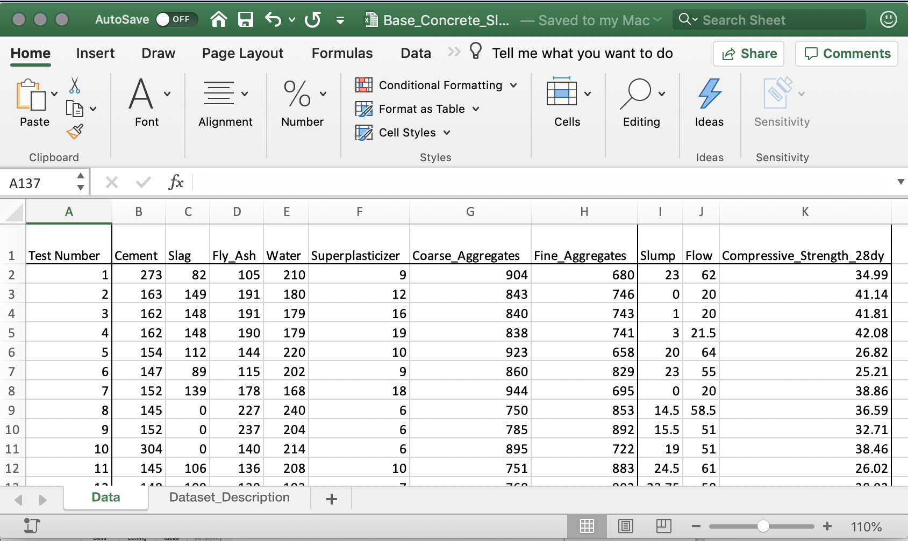

**THIS NOTEBOOK CUTS OUT ALL THE BASIC STATS AND CUTS TO THE CHASE WITH MULTIVARIATE REGRESSON AND INCLUDES A SECTION ON PIECEWISE REGRESSION**

This is an [R Markdown](http://rmarkdown.rstudio.com) Notebook. When you execute code within the notebook, the results appear beneath the code.

These notebooks are typically this is designed to create a pleasing viewing environment of data analysis that allows you to include figures, text, links, etc. so that your work is better understood and can be reproduced and used with confidence.

The source code for this R notebook (Rmd suffixed files), when stored as web pages (html files), can be downloaded by clicking the button at the top of the page.

If viewing the source code in R Studio, try executing each R "chunk" by clicking the *Run* button within the chunk or by placing your cursor inside it and pressing *Cmd+Shift+Enter*.

**Warning. Typos are *Legion*!**

# 1. Introduction

When you're in [MATH 381 (Intro to Probability and Stats)](http://ecatalog.sdsmt.edu/preview_course_nopop.php?catoid=17&coid=26571) you'll get a taste of R. R is an open-source statistical package build off of an earlier generation of commercial.

The goal here is to demonstrate cracking open an excel spreadsheet in R and calculate some basic stats, create various plots to view the statistics, and finally, do some linear and multivariate regression

Another goal here is to show off some of R's features. R is a very powerful tool. When translating "powerful" from computereese to any frustrated human dialect, that means "steep learning curve." It's also a community-supported environment. When translating "powerful" from computereese to any overscheduled human dialect, that means "there are LOTS of people donating packages and libraries to R." Some have evolved to be a standard in the community. Others are highly specialized for a given discipline (but have one or two items that people outside their user communities find handy.)

But don't let that intimidate you. Once you learn one language you can slowly pick up more. Also with this demo we aren't going to get to to be an R guru in a day.

If you want a good stepping off point to learn R I'd recommend some of the resources at [Data Camp](https://www.datacamp.com/courses/free-introduction-to-r) which have some free starter tutorials for R.

# 2. Loading the Libraries

To work with R we will first have to load some libraries. This is like in C where you have the #include statement to do things like raise things to powers and stuff like that.

Some of these libraries or "packages" come with R. Others will have to be installed. Here are the ones we are using for this exercise.

Also in this exercise, we're going to use the [tidyverse](https://www.tidyverse.org) set of packages. Tidyverse is a set of co-developed tools for data science in R. This is the new big thing in R and is widely used so we are just going to jump in here. SD Mines has a course beyond Engineering Stats, [MATH 443/543 (Data Analysis)](http://ecatalog.sdsmt.edu/preview_course_nopop.php?catoid=17&coid=26973) that leverages this set of packages.

-   Install Us First
    -   [tidyverse](https://www.tidyverse.org) : Set of commonly-used Data Science packages for R that it can install and load all at once. In the long-run you probably also want to install the tidyverse package suite anyway. For this exercise this will include...
        -   [ggplot2](https://ggplot2.tidyverse.org) : Create Elegant Data Visualizations Using the Grammar of Graphics
        -   [tibble](https://tibble.tidyverse.org) : Simple Data Frames
        -   [tidyr](https://tidyr.tidyverse.org) : Tools for shepherding data in data frames.
        -   [readr](https://readr.tidyverse.org) : Read Rectangular Text Data
        -   [purr](https://purrr.tidyverse.org) : Functional Programming Tools
        -   [dplyr](https://dplyr.tidyverse.org) : A grammar of data manipulation
        -   [stringr](https://stringr.tidyverse.org) : Simple, Consistent Wrappers for Common String Operations
        -   [forcats](https://forcats.tidyverse.org) : Tools for Working with Categorical Variables (Factors)
    -   [readxl](https://www.rdocumentation.org/packages/readxl/versions/1.1.0) : also part of the [tidyverse](https://www.tidyverse.org) package suite for reading traditional excel spreadsheets.\
-   This should come with R's core install, if not install 'em.
    -   [MASS](https://www.rdocumentation.org/packages/MASS/versions/7.3-50) : Has a lot of resources for regression.
-   This doesn't come with R's core install so install that one...
    -   [moments](https://www.rdocumentation.org/packages/moments/versions/0.14) : This has a load of good stuff for data analysis and plotting, more than you will need here, but get it anyway.
-   This is a nice contributed library that lets us make pretty statistics tables. It was written for ecological applications but it's still pretty handy for looking at concrete
    -   [pastecs](https://www.rdocumentation.org/packages/pastecs/versions/1.3.21): Package for Analysis of Space-Time Ecological Series
-   Another nice contributed library that makes matrices of correlation coefficients look pretty (and graphically informative).
    -   [corrplot](https://www.rdocumentation.org/packages/corrplot/versions/0.84) Visualization of a Correlation Matrix

```{r}

  # Tidyverse Handling Libraries

  suppressMessages(library(package = "tidyverse"))   # main tidyverse suite
  library(package = "readxl")     # Read Excel Files
  library(package = "moderndive") # Tidyverse-Friendly Introductory Linear Regression

  # Statistics Libraries

  #library(package = "moments")   # Moments, cumulants, skewness, kurtosis and related tests
  #library(package = "MASS", warn.conflicts=FALSE)      # Support Functions and Datasets for Venables & Ripley's MASS text

  # Extra Graphics Libraries

  library(package = "corrplot")  # Visualization of a Correlation Matrix


  # Data Processing Libraries

  library(package = "pastecs")   # Package for Analysis of Space-Time Ecological Series


```

# 3. Cracking a Spreadsheet

The spreadsheet example below is a more complicated than what you hopefully have.

The original data set is from a set of papers on Concrete by I-Cheng Yeh

-   [Yeh, I-Cheng, "Modeling slump of concrete with fly ash and superplasticizer," *Computers and Concrete*, **5**(6), 559-572, 2008. doi: 10.12989/cac.2008.5.6.559.](http://www.techno-press.org/content/?page=article&journal=cac&volume=5&num=6&ordernum=4)

-   [Yeh, I-Cheng, "Simulation of concrete slump using neural networks," *Construction Materials*, **162**(1), 11-18, 2009. doi: 10.1680/coma.2009.162.1.11](https://www.icevirtuallibrary.com/doi/10.1680/coma.2009.162.1.11)

-   [Yeh, I-Cheng, "Prediction of workability of concrete using design of experiments for mixtures," *Computers and Concrete*, **5**(1), 1-20, 2008. doi: 10.12989/cac.2008.5.1.001](http://www.techno-press.org/content/?page=article&journal=cac&volume=5&num=1&ordernum=1)

-   [Yeh, I-Cheng, "Modeling slump flow of concrete using second-order regressions and artificial neural networks," *Cement and Concrete Composites*, **29**(6), 474-480, 2007. doi: 10.1016/j.cemconcomp.2007.02.001](https://www.sciencedirect.com/science/article/pii/S0958946507000261?via%3Dihub)

-   [Yeh, I-Cheng, "Exploring concrete slump model using artificial neural networks," *ASCE J. of Computing in Civil Engineering*, **20**(3), 217-221, 2006. doi: 10.1061/(ASCE)0887-3801(2006)20:3(217)](https://ascelibrary.org/doi/10.1061/%28ASCE%290887-3801%282006%2920%3A3%28217%29)

and is kept at the [UC-Irvine Machine Learning Repository](https://archive.ics.uci.edu/ml/datasets/Concrete+Slump+Test).

It can be found here at [http://kyrill.ias.sdsmt.edu/cee_284/Base_Concrete_Slump_Test_for_R.xlsx](http://kyrill.ias.sdsmt.edu/wjc/eduresources/Base_Concrete_Slump_Test_for_R.xlsx)

The relevant page and screenshot is below. For drama-free R import you are probably best off keeping a page on your spreadsheet file that is very simple, with numbers going down, and a single line for Row-1 with the headers of each column. If you want to get fancy on other pages that you'd turn in as tables in reports, you can do that on another spreadsheet page.



To crack open the spreadsheet we will want to use the [read_excel](https://www.rdocumentation.org/packages/readxl/versions/1.1.0/topics/read_excel) function.

You can read the spreadsheet from a local drive or from a website.

```{r}

  # you will need the full path to the file you are using (either online or locally on your disk)

  # The if else block should query your machine to determine which operating system.
  #  if you are not bi-platform, you likely don't need this.

  if(.Platform$OS.type == "windows") {
    # Windows
    spreadsheet_name     = "%HOMEPATH%/Downloads/Base_Concrete_Slump_Test_for_R.xlsx"
  } else {
    # Unix (Linux, MacOS, Solaris)
    spreadsheet_name     = "~/Downloads/Base_Concrete_Slump_Test_for_R.xlsx"
  }


  # I am keeping a copy of these spreadsheet at the URL below.  It can be downloaded automatically
  #   and then loaded.  We can also discretely delete it when done.

      spreadsheet_url = "http://kyrill.ias.sdsmt.edu/wjc/eduresources/Base_Concrete_Slump_Test_for_R.xlsx"
   
      download.file(url      =   spreadsheet_url, # URL location
                    destfile = spreadsheet_name) # local downloaded location
      
      remove(spreadsheet_url) # clean up variables
  
  # this command will read the file

  concrete = read_excel(path      = spreadsheet_name,  # remove spreadsheet location
                        sheet     = "Data",            # page of spreadsheet
                        col_names = TRUE)              # first row are the column headers
  
  
  # clean up your hard drive!  Don't be like me!

  if(.Platform$OS.type == "windows") {
    # Windows
    system(str_c("DEL   ", 
                 spreadsheet_name,
                 sep=""))
    } else {
    # Unix (Linux, MacOS, Solaris)
    system(str_c("rm -v  ", 
                 spreadsheet_name,
                 sep=""))
      }
  
  remove(spreadsheet_name) # clean up variables

  
```

With the data read in we can now look at the table of the data. This looks much nicer when working in R Notebooks instead of Plain Ordinary R.

```{r}

  # Print data frame
  colnames(concrete)[1] = "Test_Number"
  print(concrete)

```

For our purposes let's remove the dependant variables, Fine_Aggregates, and Flow, as well as the Test_Number.  

This uses the [select()](https://dplyr.tidyverse.org/reference/select.html) from the dplyr libraries.

Another thing we need to do here is now that we have loaded with the [MASS](https://cran.r-project.org/web/packages/MASS/index.html) library (which also uses their own [MASS::select()]() function) we need to be very specific when working with [dplyr](https://dplyr.tidyverse.org).


```{r}

  # Slimmed Down Dataframe

  concrete = concrete %>%
    select(-c( Test_Number,
               Slump,
               Flow))

```


# 4 Reviewing Correlations

Let's start by reviewing how all our variables compare to one another.

An easy function for this is the basic [cor()](https://www.rdocumentation.org/packages/stats/versions/3.6.2/topics/cor) function.

```{r}

# calculate all correlation values against each other

correlation_matrix = cor(x      = concrete, # using our dataframe to correlate evything
                         method = "pearson" )

tbl_df(correlation_matrix)

```

Lots of numbers... not all that insightful on their own...

The [corrplot()](https://www.rdocumentation.org/packages/corrplot/versions/0.92/topics/corrplot) function will make the correlation table into a more visual style::

```{r}

  # draw a coorelation graphic...

  corrplot(corr   = correlation_matrix,
           type   = "upper")

```

We can now see for example that cement, slag, and fly ash amounts have a nominal but not thrilling correlation to compression strength while water has a good correlation with the resulting slump values. One thing that this does *not* show is how well these parameters play with other parameters. As we'll see when all of our independent values are working together we'll discover that cement and water, followed by fly ash and coarse aggregates will, together, contribute the most of our independent parameters in calculating the compressive strength.

***SNIP!***

# 5. Multivariate Linear Regression

Now let's predicting our compressive strength using 

We're now going to use not just one independent variable... but all 7 of them!

The good news is that it follows the same form as the simple linear regression. This time we string along all of our independent variables with in our formula prototype.

Our formula now has multiple independent values but still follows the same style of solution...

$\widehat{y}(\mathbf{x}) = {\alpha_0}+{\alpha_1} x_1 + {\alpha_2} x_2 + {\alpha_2} x_3 + ... +{\alpha_n} x_n$

```{r}

linear_model.S_v_all <- lm(data    = concrete,                             # your data frame
                           formula = Compressive_Strength_28dy ~ Cement +  # your formula
                                                                 Slag +
                                                                 Fly_Ash +
                                                                 Water +
                                                                 Superplasticizer +
                                                                 Fine_Aggregates +
                                                                 Coarse_Aggregates)  


```

And here are these results...

```{r}

summary(object = linear_model.S_v_all)


```

Our regression coefficients are still here under the "Estimate" column as are our Standard Error of our Estimate and our Coeff of Determination.

Also we can now take a good look at those asterisks at the end of line with the parameter coefficients. These can explain which independent variables do the heaviest lifting in our regression. The more asterisks, the more important the dependent variable is to the larger multivariate regression. Here, we can see that the Cement and Water are doing most of the "work" in fitting our suite of independent variables to our dependent variable of Compressive Strength.

Finally there is the P parameter for which the smaller it is, the better we can say that the relationship that we've made with our regression represents our dependent variable.

Now... on to looking at our results.

Here is where viewing the results of the regression is tricky.

We have 7 independent variables but we'd like to see the impact of the fit if all 7 variables on our strength

When I do this I like to plot the true y value against my regression y(x1,x2,x3,..)

So to do this I will take the fitted values of y and plot them against the original values of y

Getting the fitted values is easy.

I'm using the get_regression_points function which adds the modeled "y-hat" value to the dataframe of all of the other values [get_regression_points()](https://www.rdocumentation.org/packages/stats/versions/3.5.1/topics/fitted) function.

The fitted version is the dependent variable w/ a "\_hat"" at the end

```{r}

fitted.S_v_all = get_regression_points(model = linear_model.S_v_all)

print(fitted.S_v_all)

```

And finally we can plot our actual vs modeled values. (I'm adding a trend line)

```{r}


# Making a simple X-Y scatterplot and adding a regression to it

ggplot(data = fitted.S_v_all) +           # invoke graphics environment using a given dataframe
  
  theme_bw( ) +                           # changing the plotting theme
  
  aes(x      = Compressive_Strength_28dy,    # x-value
      y      = Compressive_Strength_28dy_hat) +  # y-value

  ggtitle("Yeh Superplasticizer Tests",
          subtitle = "28-dy Compressive Strength (MPa)") +    # EDITED: Custom Title now with a subtitle
  
  ylab("Modeled")     + # y-label
  xlab("Observed")     + # x-label

  geom_point(colour="darkred") +  # plot points
  
  geom_smooth(method  = "lm",      # use a simple linar model
              formula = y ~ x,     # lm-style formula
              se      = TRUE,      # display Confidence Intervals
              level   = 0.95,      # Confidene Level to Map Out
              colour  = "red",     # regression line color
              fill    = "magenta", # fill for confidence limits
              size    = 0.5)  +    # line thickness
  
  geom_abline(slope     = 1,       # NEW: add a very simple line
              intercept = 0,       #  (for a 1:1 reference)
              color     = "grey",
              linetype  = "dashed") +

  coord_fixed(ratio = 1)           # NEW: make the aspect ratio 
                                   #   (I like my plots square)
```

And here we have a nice plot showing our true vs predicted values.

# 6. Regression Quality Metrics

And to close things off, we can do some general error metrics that may be useful..

First, the Mean Squared Error (MSE) or Bias... (if we are too high or too low)

$BIAS = MSE = \frac{1}{N} \sum_{i=1}^{n} [\widehat{y}(\overrightarrow{x_i})-y_i] = \overline{[\widehat{y}(\overrightarrow{x_i})-y_i]}$

```{r}
  # Calculate Bias (MSE)

  bias = mean(fitted.S_v_all$Compressive_Strength_28dy_hat - 
              fitted.S_v_all$Compressive_Strength_28dy)
  
  print(str_c(" Mean Squared Error (MSE) or Bias: ", bias))
```

For a linear or multivariate regression the average of our residuals (the difference between each observation and prediction) *should* be zero.

The root mean squared error (RMSE) is shown here. It shouldn't be zero since the residuals are squared before summing them up. We technically should use the standard error of the estimate, but RMSE remains a common error metric. We can always do both. The standard error of the estimate takes into account the degrees of freedom which which now includes all of the independent variables (p). We can get the standard error of the estimate from our

$RMSE = \sqrt{ \frac{1}{N} \sum_{i=1}^{n} [\widehat{y}(\overrightarrow{x_i})-y_i]^2 } = \sqrt{\overline{[\widehat{y}(\overrightarrow{x_i})-y_i]^2} }$

$s_{e}$ or $s_{y/x} = \sqrt{ \frac{1}{N-p-1} \sum_{i=1}^{n} [\widehat{y}(\overrightarrow{x_i})-y_i]^2 }$

```{r}
  # Calculate RMSE

  rmse = sqrt(mean( (fitted.S_v_all$Compressive_Strength_28dy_hat -
                     fitted.S_v_all$Compressive_Strength_28dy      )^2)  )
  
  print(str_c("     Root Mean Squared Error (RMSE): ",  
              rmse))
  print(str_c("Standard Error of the Estimate (se): ", 
              summary(linear_model.S_v_all)$sigma))  # you have to dig for this one!
```

And finally our correlation coefficient (which is basically our coefficient of determination before the "R" is "squared")

```{r}
  # Get The Unadjusted Correlation Coefficient

  r = cor(x = fitted.S_v_all$Compressive_Strength_28dy,     # the x-value 
          y = fitted.S_v_all$Compressive_Strength_28dy_hat, # the y-value
          method = "pearson"                                # method of correlation
          )
  
  print(str_c("                        correlation coefficient (r): ", r))
  print(str_c("                  coefficient of determination (r²): ", r^2, 
                                                                 " ", 
                                 summary(linear_model.S_v_all)$r.squared))
  print(str_c("adjusted coefficient of determination (Adjusted r²): ", 
               summary(linear_model.S_v_all)$adj.r.squared))


```

# 8. Stepwise Multivariate Variables

For cases with [a lot of immutable independent variables](https://cran.r-project.org/web/packages/olsrr/vignettes/variable_selection.html) you may want to try an iterative regression which will rotate through various combination in independent combinations.

I recommend the function, [step]() 

```{r}

model <- lm(Compressive_Strength_28dy ~ ., 
            data  = concrete)

summary(model)

print("----------------------------------------------------------")

model_stepwise = step(object    = model, 
                      direction = "both", 
                      trace     = FALSE)

summary(model_stepwise)

```

```{r}

y_pred_lm = predict(model)

sst = sum((concrete_trimmed$Compressive_Strength_28dy - mean(concrete_trimmed$Compressive_Strength_28dy))^2)
ssr_lm = sum((concrete_trimmed$Compressive_Strength_28dy - y_pred_lm)^2)

print(sst)
print(ssr_lm)
```

With that out of the way I recommend

```{r}

library(package = olsrr)

model  <- lm(Compressive_Strength_28dy ~ ., data = concrete)

```

```{r}


# stepwise aic forward regression
model <- lm(Compressive_Strength_28dy ~ ., data = concrete)
ols_step_backward_aic(model, details = TRUE)

```

```{r}


# stepwise aic forward AND backward regression
stepwise_both = ols_step_both_aic(model, details = TRUE)
stepwise_both

```

```{r}
stepwise_both
```

```{r}

```

# 10. Closing

And with that, we're done... Once again, this exercise demonstrates a lot of tricks just to show how you can use R for various statistics. You may not use all of them in your encounters with R for linear or multivariate regression or even at all, but you may be able to cannibalize some of the tricks here for other applications.
